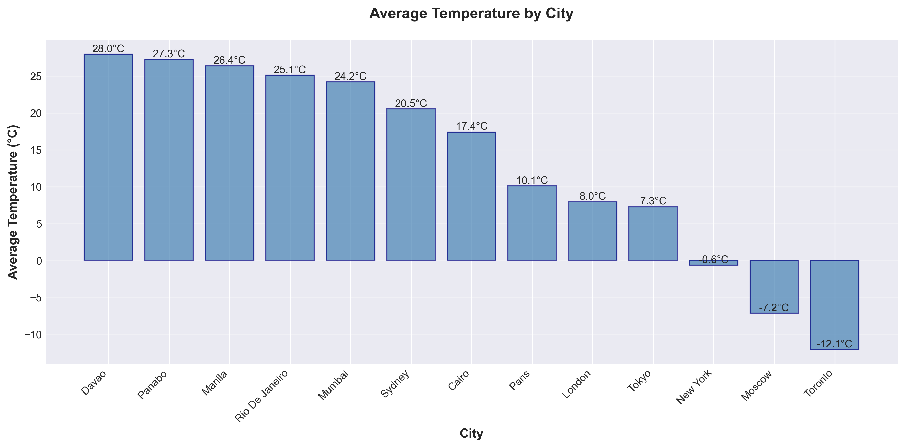

## Weather ETL Pipeline - OpenWeatherMap → SQLite

<p align="center">
  
</p>
A complete end-to-end ETL (Extract, Transform, Load) pipeline that collects real-time weather data from the OpenWeatherMap API, processes it, stores it in a SQLite database, and generates insightful visualizations.

## Project Overview

This project implements a complete **ETL/ELT pipeline** that:

- **Extracts** current weather observations for multiple cities via the OpenWeatherMap Current Weather API
- **Transforms** raw JSON responses into a clean, enriched, analysis-ready dataset
- **Loads** structured data into a **SQLite** database with proper indexing and upsert logic
- **Visualizes** key meteorological patterns and distributions using matplotlib and seaborn

## FLOW

1. OpenWeatherMap API
    
2. extract_weather.py -> weather_data_*.json (timestamped)
    
3. transform_weather.py -> transformed_weather_data.csv
    
4. load_weather.py -> weather.db
    
5. visualize_weather.py -> charts & reports

## Features

- Modular pipeline with separate scripts for each stage
- Rate-limit friendly extraction (configurable delay between requests)
- Automatic processing of all historical raw JSON files
- Data quality checks (duplicates, invalid ranges, missing value imputation)
- Derived features: temperature range, categories, wind categories, time components
- Upsert logic to prevent duplicate city-timestamp entries
- Comprehensive set of visualizations (trends, comparisons, heatmaps, scatter plots, dashboard)
- Text-based statistics report

## Output
<p align="center">
  
</p>
<p align="center">
  Temperature Comparison
</p>

## Prerequisites

- Python 3.8+
- OpenWeatherMap API key (free tier sufficient)
- Required Python packages (see below)

### Installation
```bash
# 1. Clone the repository
git clone https://github.com/DitchyBrim/Weather-ETL.git
cd Weather-ETL
# 2. Create virtual environment (recommended)
python -m venv venv
source venv/bin/activate    # Linux/macOS
# or
venv\Scripts\activate       # Windows

# 3. Install dependencies
pip install -r requirements.txt
```

## Usage
```bash
# Step 1: Extract raw data for multiple cities
python extract_weather.py

# Step 2: Transform all available raw JSON files
python transform_weather.py

# Step 3: Load transformed data into SQLite
python load_weather.py

# Step 4: Generate visualizations and statistics report
python visualize_weather.py
```